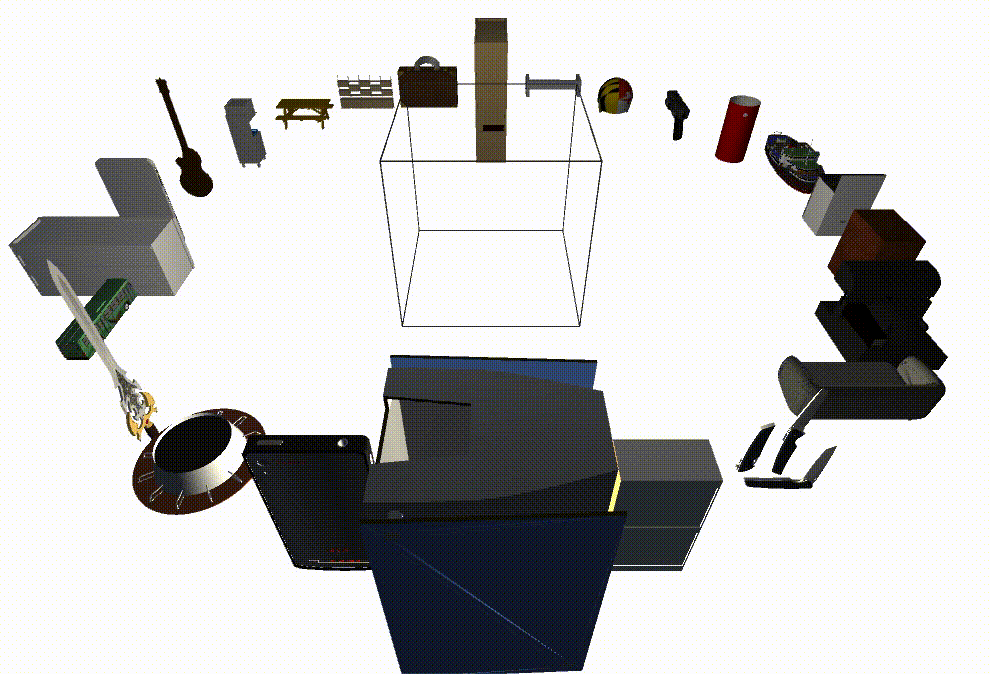
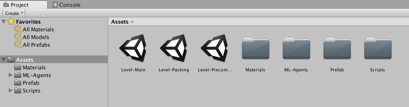
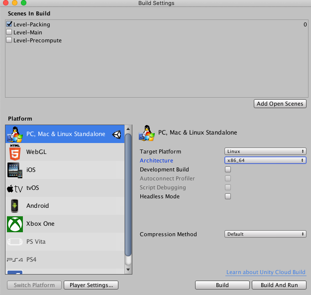
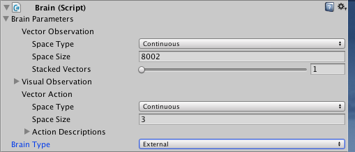
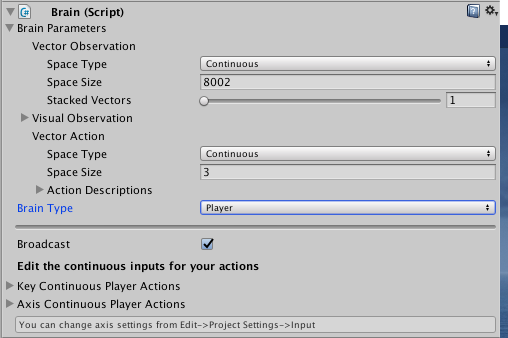
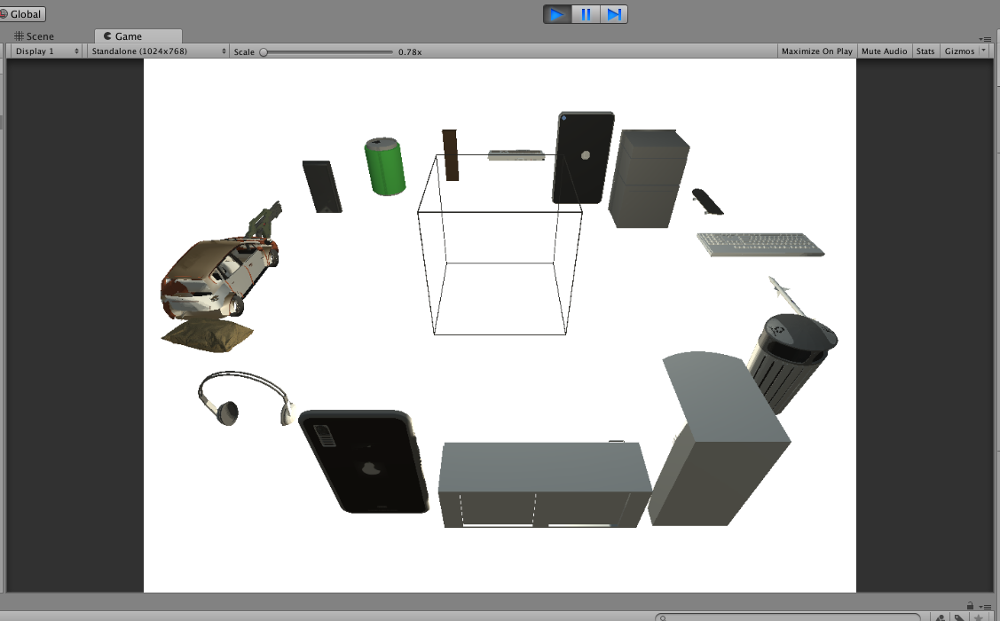

[**PackIt: A Virtual Environment for Geometric Planning**](http://arxiv.org/abs/2007.11121)  
[Ankit Goyal](http://imankgoyal.github.io), [Jia Deng](https://www.cs.princeton.edu/~jiadeng/)  
*International Conference on Machine Learning (ICML), 2020*
```
@inproceedings{goyal2020packit,
  title={PackIt: A Virtual Environment for Geometric Planning},
  author={Goyal, Ankit and Deng, Jia},
  booktitle={International Conference on Machine Learning},
  year={2020},
}
```
*For reproducing the results of the paper and using our generated dataset, use the [main repository](https://github.com/princeton-vl/PackIt). This repository contains code for generating more data. We recommend using the main repository first and only use this one if more data is required.* 


## Getting Started

First download/clone the repository. We would refer to the directory containing the code as `<packit_dir>`.

```
git clone git@github.com:princeton-vl/PackIt_Extra.git
```

#### Requirements
The PackIt environment is build using [Unity ML-agents](https://github.com/Unity-Technologies/ml-agents/tree/0.4.0) version **0.4.0**.
We provide standlone [Unity builds for Linux x86_64 platform](https://docs.unity3d.com/2017.4/Documentation/Manual/BuildSettingsStandalone.html).
For creating the builds, we use [Unity](https://unity.com/) version **2017.4.3**.  

#### Download Data
Make sure you are in `<packit_dir>`. `download.sh` script downloads all the data, unzips them and, places them at correct locations. Note that symbolic links are created between the `<packit_dir>/unity-build/StreamingAssets` folder and appropriate locations inside the unity data directory. This is necessary so that the data is accessible from the build unity game.
```
chmod +x download.sh
./download.sh
```

## Code Organization
- `<packit_dir>/unity-assets`: Unity levels and C# scripts used for making unity builds from scratch.

- `<packit_dir>/unity-build`: Prebuild unity games and data for generating new packs.


## Evolving new packs
1. Make sure you have downloded everything before this step.  
1. To generate a new pack, use the `<packit_dir>/unity-build/generate.sh` script. To generate 5 new packs for the training data first `cd unity-build` and the use the command `./generate.sh --dataset tr --num_packs 5 --run 201`. This would generate packs at `<packit_dir>/unity-build/StreamingAssets/pack_tr/201_tr`. For faster loading of data, we precompute some voxel features which would be generated in `<packit_dir>/unity-build/StreamingAssets/pack_tr_precompute_<unity/python>/201_tr_<0/1/2/3/4>`.

## Code for making you own unity build 
We provide standlone unity build. In case you want to create your own unity builds follow the following steps. We strongly recommend familiarizing oneself with [Unity](https://unity.com/) first. Follow the steps below before making any unity build.

1. Download and install [Unity 3D](https://unity.com/). We recommend installing version **2017.4.3**. Make sure you select the required `Build Support` while installing Unity. For example, select `Linux Build Support` if you want to make builds for Linux.

1. Place the contents of `<packit_dir>/unity-assets` inside  the `Assets` folder. The `Assets` folder should look like the following:

    

1. To [set up ML-Agents inside Unity](https://github.com/Unity-Technologies/ml-agents/blob/0.4.0/docs/Basic-Guide.md), go to **Edit > Project Settings > Player**. In **(PC, Mac and Linux Standalone, iOS or Android)**, go to the **Other Settings** section.
Then, select **Scripting Runtime Version to Experimental (.NET 4.6 Equivalent)** option. 

1. (Optional) You can place the `<packit_dir>/unity-build/StreamingAssets` folder inside `Assets`. This would allow running the environment inside the editor.

1. Now follow the steps of the particular unity build you want to make:

- #### Packing
  This unity build, along with `Precompute` is used for generating packs. 
  After running `download.sh`, this build is placed at `<packit_dir>/unity-build/packing<_Data/.x86_64>`. 
  Following are the steps to make this build:  
  
  1. Go to **File > Build Settings**.
  1. Select **only** the `Level-Packing` in the **Scenes In Build** option. You might have to first open `Level-Packing` and then click `Add Open Scenes`. 
  1. Select the **Target Platform** and press **Build**. A sample image can be found below.
  
      
  
  1. In case you didn't place the `<packit_dir>/unity-build/StreamingAssets` folder inside `Assets`, you would have to create a symbolic link as done [here](https://github.com/princeton-vl/Packit_Extra/blob/master/download.sh#L19) for a Linux Build.

- #### Precompute
  This unity build, along with `Packing` is used for generating packs.
  After running `download.sh`, this build is placed at `<packit_dir>/unity-build/precompute<_Data/.x86_64>`. 
  Following are the steps to make this build:
  
  1. Go to **File > Build Settings**.
  1. Select **only** the **Level-Precompute** in the **Scenes In Build** option. You might have to first open **Level-Precompute** and then click **Add Open Scenes**. 
  1. Select the **Target Platform** and press **Build**.
  1. In case you didn't place the `<packit_dir>/unity-build/StreamingAssets` folder inside `Assets`, you would have to create a symbolic link as done [here](https://github.com/princeton-vl/Packit_Extra/blob/master/download.sh#L19) for a Linux Build.
  
- #### PackIt Env
  This unity build is used for the packit environment in the [main repository](https://github.com/princeton-vl/PackIt). 
  After running `download.sh` in the [main repository](https://github.com/princeton-vl/PackIt), this build is placed at `<packit_dir>/unity/envs/packit_<_Data/.x86_64>`.
  Following are the steps to make this build:
    
  1. Update all the arguments in [`Assets/Scripts/PackingEnv/PackingAgent`](https://github.com/princeton-vl/PackIt/blob/master/unity-assets/Scripts/PackingEnv/PackingAgent.cs#L48-L57) for unity agent.
  1. Open **Level-Main** and click **Academy > Brain**. 
  1. In the **Brain Type** option, select **External**. Save the **Level-Main** scene.
  
      
      
  1. Go to **File > Build Settings**.
  1. Select **only** the **Level-Main** in the **Scenes In Build** option. You might have to first open **Level-Main** and then click **Add Open Scenes**. 
  1. Select the **Target Platform** and press **Build**.
  1. In case you didn't place the `<packit_dir>/unity-build/StreamingAssets` folder inside `Assets`, you would have to create a symbolic link as done [here](https://github.com/princeton-vl/Packit_Extra/blob/master/download.sh#L19) for a Linux Build.

- #### PackIt Viz Env
  This unity build is used for the packit environment in the [main repository](https://github.com/princeton-vl/PackIt).
  After running `download.sh` in the [main repository](https://github.com/princeton-vl/PackIt), this build is placed at `<packit_dir>/unity/envs/packit_viz<_Data/.x86_64/_mac.app>`. 
  Following are the steps to make this build:
  
  1. Update all the arguments in [`Assets/Scripts/PackingEnv/PackingAgent`](https://github.com/princeton-vl/PackIt/blob/master/unity-assets/Scripts/PackingEnv/PackingAgent.cs#L48-L57) for visualizer.
  1. Open **Level-Main** and click **Academy > Brain**. 
  1. In the **Brain Type** option, select **Player**. Save the **Level-Main** scene.
  
      
      
  1. (Optional) In case you moved the `StreamingAssets` folder insider `Assets`, you can check the visualizer inside the Unity Editor. On clicking **Play**, the game would look as follows. Press `a` to execute the next action.
  
     
     
  1. Go to **File > Build Settings**.
  1. Select **only** the **Level-Main** in the **Scenes In Build** option. You might have to first open **Level-Main** and then click **Add Open Scenes**. 
  1. Select the **Target Platform** and press **Build**.
  1. In case you didn't place the `<packit_dir>/unity-build/StreamingAssets` folder inside `Assets`, you would have to create a symbolic link as done [here](https://github.com/princeton-vl/Packit_Extra/blob/master/download.sh#L19) for a Linux Build.

